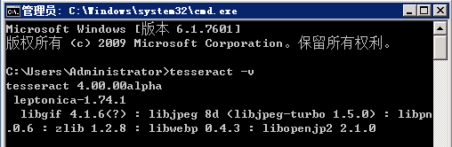

# Tsseract文字识别<sup>shine</sup>

前言

>Tesseract的OCR引擎最先由HP实验室于1985年开始研发，至1995年时已经成为OCR业内最准确的三款识别引擎之一。然而，HP不久便决定放弃OCR业务，Tesseract也从此尘封。 数年以后，HP意识到，与其将Tesseract束之高阁，不如贡献给开源软件业，让其重焕新生–2005年，Tesseract由美国内华达州信息技术研究所获得，并求诸于Google对 Tesseract进行改进、消除Bug、优化工作。

### Windows环境安装tesseract-ocr 4.00并配置环境变量

- 下载地址：[tesseract-ocr-setup-4.00.00dev安装文件](http://digi.bib.uni-mannheim.de/tesseract/tesseract-ocr-setup-4.00.00dev.exe "点击下载")

- 安装：直接运行`tesseract-ocr-setup-4.00.00dev.exe`文件，下一步、同意协议下一步、所有用户使用下一步、安装。
    
- 选择语言：默认只有英文字体。选择所有字体安装有1G多，也没必要。所以我们只新增`简体`和`繁体`中文。


安装过程中会自动下载字体，可能会有点慢（视网络情况）。所以特别注意不要安装一些无需的字体！

- 配置环境变量：因为我们需要命令式执行文件，所以安装好后需要配置环境变量。在我的电脑上右键选择“属性-->高级属性设置-->环境变量”，给系统变量Path追加`;C:\Program Files (x86)\Tesseract-OCR`(根据你的安装目录相应变化)。同时在系统变量下面新建一个变量`TESSDATA_PREFIX`，其值一样为`C:\Program Files (x86)\Tesseract-OCR`配置好了点击保存，并重启电脑。

	>`TESSDATA_PREFIX`变量是解决跨盘读取字库问题。如果没有新建将不能在其他盘调用字库。

- 测试安装：打开CMD命令终端，输入：`tesseract -v` 可以看到版本信息说明安装成功。


- 识别图片：识别图片命令`tesseract 图片名称 生成结果的文件名称 -l 字体库`，如：
```
tesseract img/txt.png result -l chi_sim --psm 6
```
不出意外的话就会得到一个含有结果的`result.txt`文件。

### 文字识别应用:破解验证码

废话少说，让程序自动识别验证码可用于自动登录。在此我准备了一张真实网站上的验证码


此验证码可以变色，所以我截图了好几个。让我们尝试一下：
```
tesseract img/code.jpg result -l chi_sim --psm 6
```
破解为`少 85237581 40`可见这结果并不理想。

	在此我们故意仍使用中文字体破解，如果使用英文字体破解效果会稍好。

其实也不难理解，因为彩色图片识别度不高。如果我们对图片先`去色`，并调整`阈值`为130再去识别效果就会好很多。


>分别为：原图、去色、阈值130的效果。


测试代码[test.js](test.js)

当然，你肯定会说：“那总不能让程序自己搞PS软件去处理阈值呀！”。是的，所以我们要再安装一个自动处理图片的工具`GraphicsMagick`。

#### GraphicsMagick安装

>GraphicsMagick号称图像处理领域的瑞士军刀。 短小精悍的代码却提供了一个鲁棒、高效的工具和库集合，来处理图像的读取、写入和操作，支持超过88种图像格式，包括重要的DPX、GIF、JPEG、JPEG-2000、PNG、PDF、PNM和TIFF。

[GraphicsMagick](http://www.graphicsmagick.org/download.html "下载页面")里面含有各种系统的下载文件，而我使用的是[window64位版本](ftp://ftp.graphicsmagick.org/pub/GraphicsMagick/windows/ "windows各版本下载FTP")其文件只有4.26M。安装过程很简单，直接下一步、下一步即可。安装完后同样设置一下系统变量为新增`;C:\Program Files\GraphicsMagick-1.3.28-Q8`(根据你的安装目录相应变化)，并重启电脑。

- 测试安装

在CMD命令里输入`gm`回车，如果能看到以下信息表示安装成功：

```
GraphicsMagick 1.3.28 2018-01-20 Q8 http://www.GraphicsMagick.org/
Copyright (C) 2002-2018 GraphicsMagick Group.
Additional copyrights and licenses apply to this software.
See http://www.GraphicsMagick.org/www/Copyright.html for details.
Usage: gm command [options ...]

Where commands include:
      batch - issue multiple commands in interactive or batch mode
  benchmark - benchmark one of the other commands
    compare - compare two images
  composite - composite images together
    conjure - execute a Magick Scripting Language (MSL) XML script
    convert - convert an image or sequence of images
       help - obtain usage message for named command
   identify - describe an image or image sequence
    mogrify - transform an image or sequence of images
    montage - create a composite image (in a grid) from separate images
       time - time one of the other commands
    version - obtain release version
   register - register this application as the source of messages
```

扩展：更多[gm](https://github.com/aheckmann/gm "github gm官网")介绍看官方文档。

- 编写执行脚本

参见：[index.js](index.js)

- 查看效果

```
node index
```

查看控制台是否正常把验证码打印出来？
